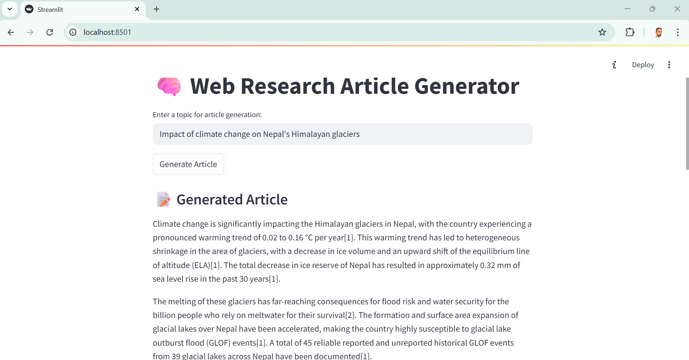

# 🧠 Web Research Article Generator

This is a Streamlit-based web application that generates informative articles on user-specified topics by performing real-time web searches and summarizing relevant content using OpenAI's GPT-4.


## 🌟 Why This Project?

This project is a **great example of combining real-time data with a large language model (LLM)** to create useful applications. It demonstrates how to:

- Integrate live web data through a search API (SerpAPI)
- Automatically scrape and filter relevant content
- Use a language model to process and generate high-quality textual output
- Build a user-friendly interface for real-time interaction

Such a pattern is foundational for many modern AI applications like intelligent agents, knowledge assistants, and autonomous research bots.

## 🚀 Features

- 🔍 Real-time web search using **SerpAPI**
- 🧠 Web scraping and relevance filtering with **GPT-4**
- ✍️ Article generation using **OpenAI ChatGPT**
- 📄 User interface built with **Streamlit**

## 🤖 How Is This Different from AI Answers in Google Search?

While Google now includes AI-generated answers directly in search results (like with Search Generative Experience or Gemini), this application takes a very different and more customizable approach. Think of this app as a **mini autonomous researcher**: it finds, filters, and synthesizes information from live sources into a coherent article — more useful for reports, blogs, and in-depth reading, while Google's AI search is optimized for quick answers and convenience. Here's how they compare:

### ✅ Advantages of This App

- **Real-Time Research with Transparency**  
  This app performs real-time web searches, scrapes actual content from multiple sources, and lets you view the URLs and some of the underlying text — giving you transparency into the research process.

- **Custom Article Generation**  
  Instead of short summaries, this app generates a complete article tailored to your query, including citations and source-based content when available.

- **Greater Control**  
  You choose the topic and drive the direction of content. Google’s AI answers are brief, curated, and predefined — you can’t customize them.

- **Research-Oriented Workflow**  
  The application is designed more like a research assistant, useful for generating drafts, overviews, or reports based on timely information.

- **Standalone & Open-Source**  
  You’re not limited by platform restrictions or proprietary UI — it’s a tool you can modify, host, and extend yourself.

### ⚠️ Downsides Compared to Google AI Search

- **Slower Response Time**  
  Because this app performs live searches, scrapes web pages, filters content, and generates long-form text, it takes more time than a quick AI blurb from Google.

- **Rate Limits & Token Costs**  
  Using GPT-4 and APIs like SerpAPI consumes tokens and may hit rate limits or incur costs, especially for high-volume use.

- **Content Quality Depends on Web Sources**  
  If the top search results are weak, missing, or behind paywalls, the generated article may not be as informative as expected.

- **Requires Setup**  
  Unlike Google, which "just works," this app requires API keys and environment setup to run.


## 🛠️ Setup Instructions

### 1. Clone the Repository

```bash
git clone https://github.com/ajayaadhikari/LLM-article-generation-web-research.git
cd article-generator
```

### 2. Create and Activate a Virtual Environment (Optional but Recommended)

```bash
python -m venv venv
source venv/bin/activate  # On Windows: venv\Scripts\activate
```

### 3. Install Required Dependencies

```bash
pip install -r requirements.txt
```
### 4. Set Up Environment Variables

Create a .env file in the project root with the following content:
```bash
OPENAI_API_KEY=your_openai_api_key
SERPAPI_API_KEY=your_serpapi_api_key
```

### 5. Run the app
```bash
streamlit run article_generator.py
```
